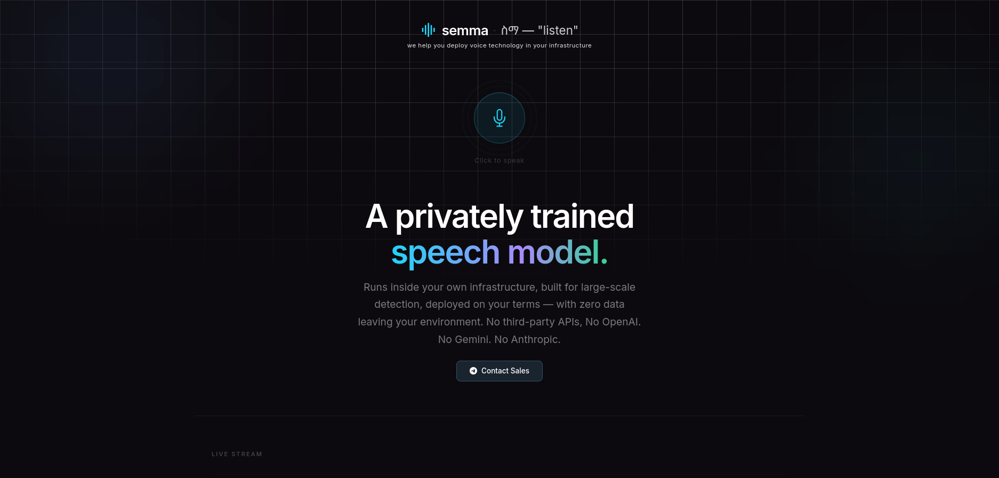

# semma

---

## What is semma?

A privately trained, speech recognition engine — that you can use for your case in your infrastructure.

---

## Built For

| Industry | Use Case |
|----------|----------|
| Telecom | Voice IVR and customer service in local languages |
| Banking | Voice KYC and transactions for unbanked populations |
| Media | Broadcast transcription and subtitle generation |
| Government | Public service voice interfaces and documentation |
| Healthcare | Doctor dictation and patient record transcription |

---

## We Deploy For You

semma is not just a model — it is a complete voice AI deployment.
We integrate, host, and maintain the full stack for your business.
You get a working product. Not a research project.

---

## Contact

Built by **Awet Tsegazeab**

Enterprise and partnerships → [Telegram](https://t.me/your_telegram)

---

*semma — ስማ — to listen*